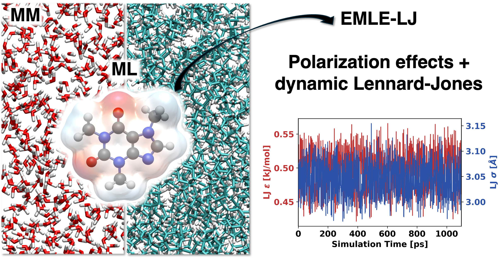

# Atomic Environment Aware Lennard-Jones Parameterization for Electrostatic Embedding ML/MM Simulations

This repository contains the supporting data, models, and figure generation code for the publication titled ["Atomic Environment Aware Lennard-Jones Parameterization for Electrostatic Embedding ML/MM Simulations"](https://doi.org/10.26434/chemrxiv.15004404/v1).



## Directory Structure

- `emle_models/`: Contains the various EMLE models trained and used in this study.
- `datasets/`: Contains the SAMPL5 dataset used for testing the EMLE models. Information about the training dataset is available in the [`supporting repository of the preceding paper`](https://github.com/michellab/EMLE_HFE_SI).
- `figures/`: Contains notebooks used to generate the figures presented in the publication, along with the figures themselves.
- `sn2_reaction`: Contains the calculations and notebooks used to generate the SN2 reaction results presented in the publication.
- `training/`: Contains the scripts and notebooks used for training.

## Associated Packages

- [`fes-ml`](https://github.com/michellab/fes-ml): Enables hybrid ML/MM free energy calculations, with support for various alchemical modifications.
- [`emle-bespoke`](https://github.com/michellab/emle-bespoke): A package which streamlines the training of EMLE models by automating conformer sampling, QM energy evaluations, and parameter fitting, with modular components for flexible use.
- [`PyXDM`](https://github.com/michellab/pyxdm): Python package for calculating XDM (Exchange-hole Dipole Moment) multipole moments using multiple atoms-in-molecules partitioning schemes. 

## Citation

If you use the code, data, or models from this repository in your research, please cite the following publication:

```bibtex
@article{Morado_2026, 
  title={Atomic Environment Aware Lennard-Jones Parameterization for Electrostatic Embedding ML/MM Simulations}, 
  url={https://chemrxiv.org/doi/full/10.26434/chemrxiv.15004404/v1}, 
  DOI={10.26434/chemrxiv.15004404/v1}, 
  author={Morado, João and Zinovjev, Kirill and Hedges, Lester O. and Michel, Julien and Cole, Daniel J.}, 
  year={2026}, 
  month=june, 
  language={en} 
}
```
