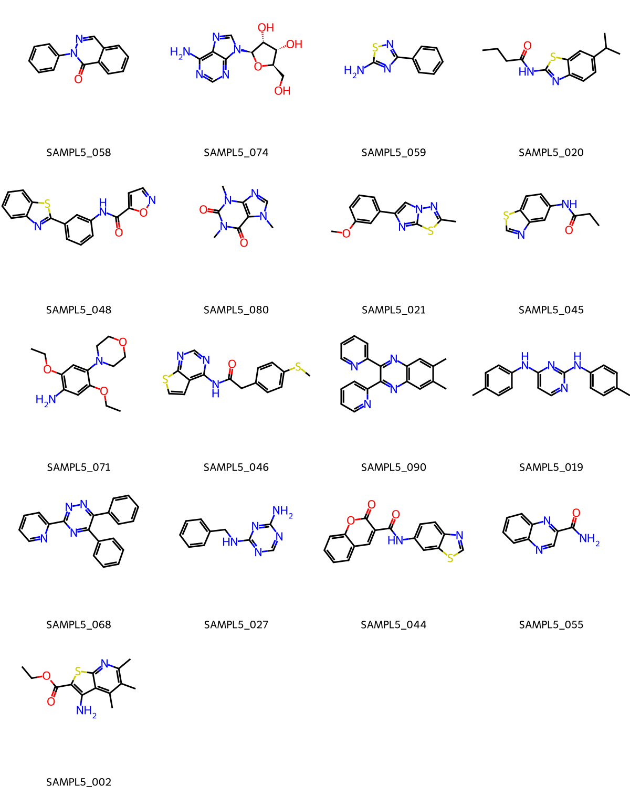

# SAMPL5

## Dataset curation

Work on identifying protomers and tautomers has already been carried out, for example, in [this study](https://link.springer.com/article/10.1007/s10822-016-9954-8) (see the section *“Consideration of tautomers after SAMPL5”*). Using the authors’ [public data](https://github.com/samplchallenges/SAMPL5_logD_PredictionAnalysis), and restricting the analysis to EMLE-supported molecules whose logD values differ by less than 0.01 from logP after pKa and state-penalty corrections, we obtain the following 17-molecule subset. For these compounds, logP should serve as a reasonably accurate approximation of logD.

| Molecule ID | SMILES |
|-------------|--------|
| SAMPL5_058 | c1ccc(cc1)n2c(=O)c3ccccc3cn2 |
| SAMPL5_074 | c1nc(c2c(n1)n(cn2)[C@H]3[C@@H]([C@@H]([C@H](O3)CO)O)O)N |
| SAMPL5_059 | c1ccc(cc1)c2nc(sn2)N |
| SAMPL5_020 | CCCC(=O)Nc1nc2ccc(cc2s1)C(C)C |
| SAMPL5_048 | c1ccc2c(c1)nc(s2)c3cccc(c3)NC(=O)c4ccno4 |
| SAMPL5_080 | Cn1cnc2c1c(=O)n(c(=O)n2C)C |
| SAMPL5_021 | Cc1nn2cc(nc2s1)c3cccc(c3)OC |
| SAMPL5_045 | CCC(=O)Nc1ccc2c(c1)ncs2 |
| SAMPL5_071 | CCOc1cc(c(cc1N2CCOCC2)OCC)N |
| SAMPL5_046 | CSc1ccc(cc1)CC(=O)Nc2c3ccsc3ncn2 |
| SAMPL5_090 | Cc1cc2c(cc1C)nc(c(n2)c3ccccn3)c4ccccn4 |
| SAMPL5_019 | Cc1ccc(cc1)Nc2ccnc(n2)Nc3ccc(cc3)C |
| SAMPL5_068 | c1ccc(cc1)c2c(nnc(n2)c3ccccn3)c4ccccc4 |
| SAMPL5_027 | c1ccc(cc1)CNc2ncnc(n2)N |
| SAMPL5_044 | c1ccc2c(c1)cc(c(=O)o2)C(=O)Nc3ccc4c(c3)scn4 |
| SAMPL5_055 | c1ccc2c(c1)ncc(n2)C(=O)N |
| SAMPL5_002 | CCOC(=O)c1c(c2c(c(c(nc2s1)C)C)C)N |

From this 17-molecule subset, we further select 9 compounds for testing, which are listed in the table below.

| Molecule ID | SMILES |
|-------------|--------|
| SAMPL5_058 | c1ccc(cc1)n2c(=O)c3ccccc3cn2 |
| SAMPL5_020 | CCCC(=O)Nc1nc2ccc(cc2s1)C(C)C |
| SAMPL5_080 | Cn1cnc2c1c(=O)n(c(=O)n2C)C |
| SAMPL5_021 | Cc1nn2cc(nc2s1)c3cccc(c3)OC |
| SAMPL5_071 | CCOc1cc(c(cc1N2CCOCC2)OCC)N |
| SAMPL5_046 | CSc1ccc(cc1)CC(=O)Nc2c3ccsc3ncn2 |
| SAMPL5_090 | Cc1cc2c(cc1C)nc(c(n2)c3ccccn3)c4ccccn4 |
| SAMPL5_019 | Cc1ccc(cc1)Nc2ccnc(n2)Nc3ccc(cc3)C |
| SAMPL5_068 | c1ccc(cc1)c2c(nnc(n2)c3ccccn3)c4ccccc4 |

## References

1. https://github.com/samplchallenges/SAMPL5
2. https://github.com/samplchallenges/SAMPL5_logD_PredictionAnalysis